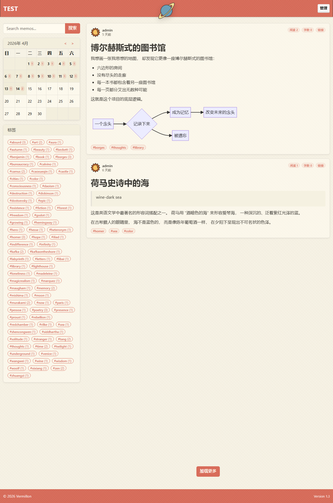

# Vermillon



Vermillon 是一个面向单用户的个人内容发布平台，基于时间流（Timeline）进行文章组织与展示。它以原生 Markdown 作为内容格式，提供独立的管理后台，采用淡黄色纸质视觉风格，旨在为个人写作者提供一个简洁、专注、可长期维护的发布工具。

---

## 核心特性

- **时间流首页**：按时间倒序展示文章，支持分页加载。
- **日历导航**：左侧日历显示每日发文数量，点击日期可快速过滤到当日内容。
- **标签系统**：在正文中使用 `#标签` 即可自动提取，支持嵌套层级（如 `#work/frontend`）。
- **Markdown 原生支持**：独立编辑页面，左栏写作、右栏实时预览，支持拖拽上传附件并自动插入 Markdown 语法。
- **代码高亮与图表**：集成 Prism.js 代码高亮（含一键复制）与 Mermaid.js 图表渲染。
- **全文搜索**：支持对 Markdown 正文进行全文检索。
- **草稿与发布**：每篇文章可保存为草稿或立即发布；未发布内容仅对管理员可见。
- **文章元数据**：自动记录字数、阅读次数、修改次数、创建与更新时间。
- **访问统计**：自动记录首页访问日志，管理后台可查看总访问量、首页访问量、今日访问量及访问明细。
- **站点设置**：管理后台可修改站点标题，设置即时生效并通过服务端渲染写入页面，避免前端闪烁。
- **Session 认证**：基于 Flask Session 的用户名/密码认证，密码使用 bcrypt 哈希存储。

---

## 快速开始

### 环境要求

- Python 3.10 或更高版本
- 或 Docker / Docker Compose

### 本地运行

```bash
git clone https://github.com/ifdog/Vermillon.git
cd Vermillon
pip install -r requirements.txt
python app.py
```

服务启动后访问 `http://localhost:5000`。

### Docker Compose 部署（推荐）

```bash
cd Vermillon
docker-compose up -d --build
```

数据持久化：
- SQLite 数据库默认挂载到 `./data/vermillon.db`
- 上传附件默认挂载到 `./data/uploads/`

可通过环境变量 `DATABASE_URL` 与 `UPLOAD_FOLDER` 自定义上述路径。

### 更新升级

若通过 Docker Compose 部署，升级步骤如下：

```bash
git pull origin main
docker-compose down
docker-compose up -d --build
```

由于数据库与附件通过宿主机卷持久化，重建容器不会导致数据丢失。

---

## 默认登录信息

- **管理后台**：`http://localhost:5000/admin`
- **登录页**：`http://localhost:5000/login`
- **默认账号**：`admin` / `admin`

**安全提示**：生产环境部署前，请务必修改默认管理员密码，并设置强度足够的 `SECRET_KEY` 环境变量。

---

## 项目结构

```
Vermillon/
├── api/                    # Flask Blueprints（REST API）
│   ├── memos.py            # 文章 CRUD、草稿状态、元数据更新
│   ├── tags.py             # 标签列表与计数
│   ├── search.py           # 全文搜索
│   ├── calendar.py         # 日历数据（含每日文章列表及字数）
│   ├── upload.py           # 附件上传
│   ├── auth.py             # Session 登录、密码修改、用户名修改
│   ├── stats.py            # 访问统计与日志
│   └── settings.py         # 站点设置
├── static/                 # 前端静态资源
│   ├── css/style.css       # 主题样式
│   ├── js/                 # 前端逻辑
│   ├── uploads/            # 附件存储
│   ├── favicon.ico         # 站点图标
│   └── user.png            # 默认用户头像
├── templates/              # Jinja2 模板（首页、编辑页、管理后台、登录页）
├── app.py                  # Flask 应用入口
├── config.py               # 配置项与环境变量读取
├── db.py                   # SQLite 初始化与连接管理
├── utils.py                # 公共工具函数
├── requirements.txt        # Python 依赖
├── PRD.md                  # 产品需求文档
├── DESIGN.md               # 设计规范文档
├── docker-compose.yml      # Docker Compose 配置
├── Dockerfile              # Docker 镜像构建文件
└── README.md               # 本文件
```

---

## 技术栈

| 层级 | 技术 |
|------|------|
| 后端 | Python 3.13 + Flask 3.0.3 |
| 数据库 | SQLite |
| 前端 | 原生 JavaScript + HTML5 + CSS3 |
| UI 框架 | Bootswatch Lumen |
| 代码高亮 | Prism.js |
| 图表渲染 | Mermaid.js |
| 密码加密 | Flask-Bcrypt |

---

## 配置说明

### 环境变量

`config.py` 读取以下环境变量：

```python
SECRET_KEY    = os.environ.get('SECRET_KEY',    'dev-secret-key-change-in-production')
DATABASE_URL  = os.environ.get('DATABASE_URL',  'vermillon.db')
UPLOAD_FOLDER = os.environ.get('UPLOAD_FOLDER', 'static/uploads')
```

生产环境建议显式设置：

```bash
# Linux / macOS
export SECRET_KEY=your-secure-secret
export DATABASE_URL=/data/vermillon.db
export UPLOAD_FOLDER=/data/uploads

# Windows PowerShell
$env:SECRET_KEY="your-secure-secret"
$env:DATABASE_URL="/data/vermillon.db"
$env:UPLOAD_FOLDER="/data/uploads"
```

### 数据库迁移

项目使用 SQLite，默认数据库文件为 `vermillon.db`。首次启动时自动建表，并创建默认管理员账号。对于后续版本的字段变更，`db.py` 内置了 `ALTER TABLE` 兼容逻辑，旧数据库无需手动迁移即可自动升级。

---

## API 概览

| 方法 | 路径 | 说明 |
|------|------|------|
| GET | `/api/memos?page=&date=&tag=&pageSize=` | 文章列表（公开仅返回已发布） |
| POST | `/api/memos` | 新建文章或草稿（需登录） |
| GET | `/api/memos/<id>` | 单条读取，同时累加阅读次数 |
| PUT | `/api/memos/<id>` | 更新文章（需登录） |
| DELETE | `/api/memos/<id>` | 删除文章（需登录） |
| GET | `/api/tags` | 标签列表及计数 |
| GET | `/api/search?q=` | 全文搜索（仅搜索已发布） |
| GET | `/api/calendar/<year>/<month>` | 日历数据 |
| POST | `/api/upload` | 上传附件（需登录） |
| POST | `/api/auth/login` | 用户名密码登录 |
| POST | `/api/auth/logout` | 登出 |
| POST | `/api/auth/change-password` | 修改密码（需登录） |
| POST | `/api/auth/change-username` | 修改用户名（需登录） |
| GET | `/api/stats` | 统计数据（需登录） |
| GET | `/api/stats/visits` | 访问日志（需登录） |
| GET | `/api/settings` | 读取站点设置 |
| POST | `/api/settings` | 更新站点设置（需登录） |
| GET | `/api/version` | 读取当前版本号 |

---

## 版本历史

- **v1.1**（当前）
  - 增加草稿/发布状态
  - 增加文章元数据（字数、阅读次数、修改次数）
  - 管理后台升级为两栏布局
  - 站点标题改为服务端渲染，消除前端闪烁
  - 标签与卡片视觉风格统一
  - 版本号采用常规数字版本

- **v1.0**
  - 首个稳定版本，包含时间流、日历、标签、Markdown 编辑、附件上传、Session 认证、访问统计等核心功能。

---

## License

MIT License

Copyright (c) 2026 Vermillon
